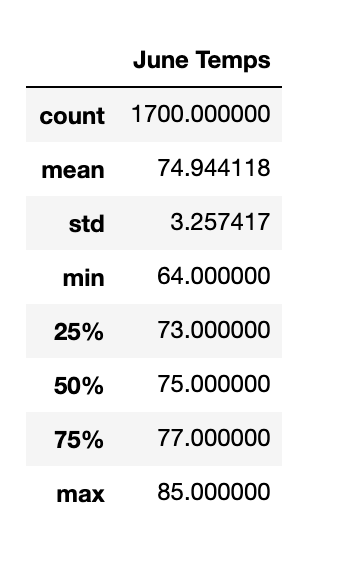
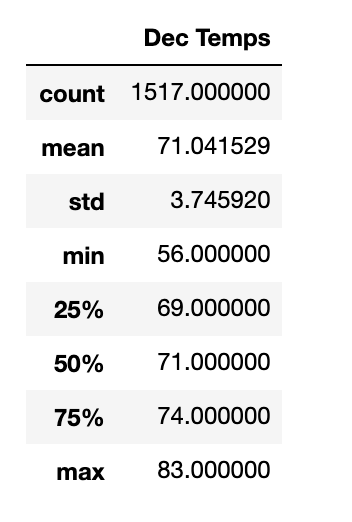

# Surfs Up

## Overview of Statistical Analysis
This project is a business venture to set-up a surf and shake shop in the Hawaiian Island of Oahu.  I will be examining temperature trends, specifically, for the months of June and December.  This is done in order to determine if the shop will be sustainable year-round.  Furthermore, this data will be presented to other investors and possibly examined for future growth and development of other surf and shake shops.  

## Results
Attached you will find two tables with a statistical analysis of the temperature trends for the months of June and December, respectively.  

 

 

As you can see from the tables, there is not much difference in weather temperatures between the summer and winter months.  This is partly due to the weather patterns created by the Pacific Ocean and it's geographical proximity to the equator.  
  - Both months show little difference in the mean and standard deviation. 
  - The minimum and maximum temperatures are within a few degrees of each other.
  - Each month has a significant amount of data points that were taken, making this a statisitically valid comparison.

## Summary
In conclusion, the weather data supports this as a successful venture for year-round tourism and surfing.  To solidify this assertion, two additional queries to perform would be:
  - Measure wind speed and direction to determine if they provide favorable surfing conditions
  - Gather tidal conditions to find the optimal surfing season.

